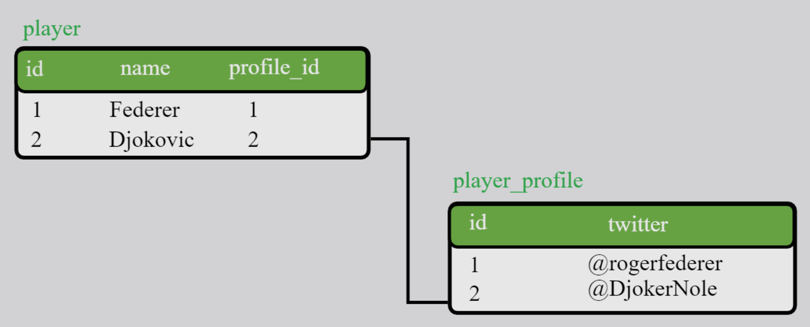
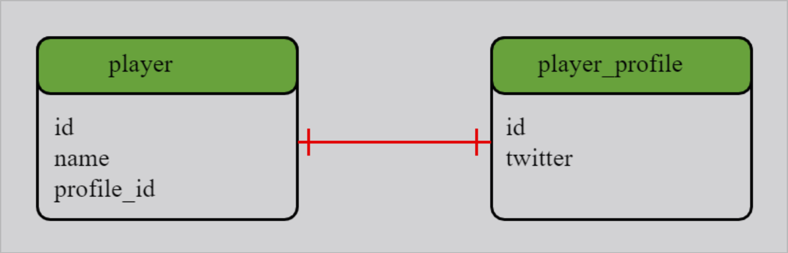
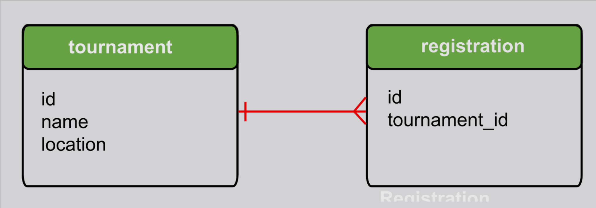
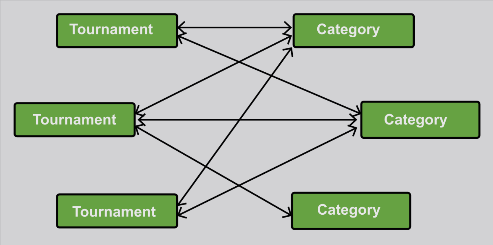
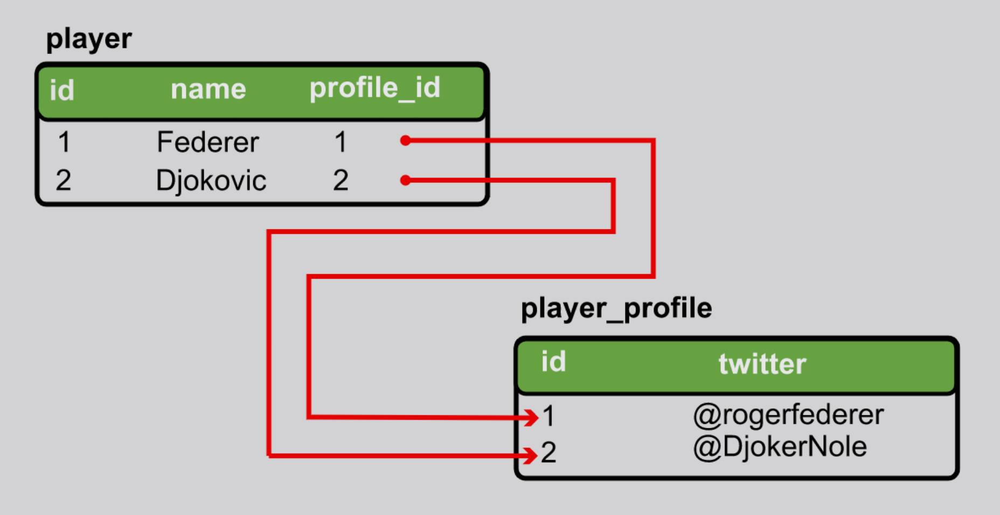
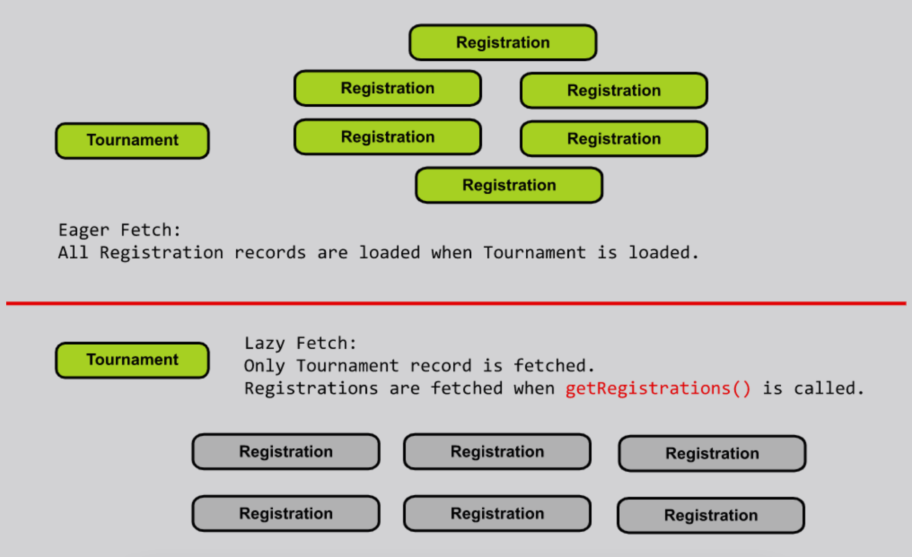
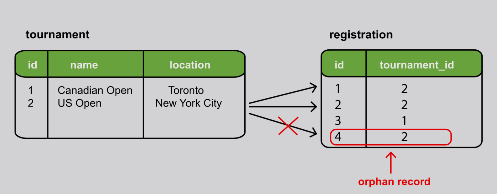

# Lesson 1: Basic Concepts

## Demonstrated Concepts

### Primary key

__Primary key__ is used to uniquely identify a row in a table.

### Foreign key

Primary key can be used to link two tables together. When a primary key of one table is used in another table, it is known as a __foreign key__.

### Database relationships

#### One-to-One relationship

When one row in _table_a_ corresponds to one row in _table_b_, then it is called a __one-to-one relationship__.

#### One-to-Many relationship

When one row in _table_a_ corresponds to many rows in _table_b_, then it is called a __one-to-many relationship__. 

The _inverse_ of a one-to-many relationship is a __many-to-one relationship__ where many rows in _table_b_ correspond to one row in _table_a_.

#### Many-to-Many relationship

When one row in _table_a_ corresponds to many rows in _table_b_ and one row in _table_b_ corresponds to many rows in _table_a_, then we have what is called a __many-to-many relationship__.

## Referential integrity

When two tables are related to one another, data should reflect a _consistent state_. All foreign keys should refer to valid, existing primary key values.

Absence of __referential integrity__ can lead to records being lost in the database.

## Cascading

__Cascading__ means propagating an operation from the owning entity to the related entity. When a record in the owning entity (parent table) is saved, updated or deleted, the change should be reflected in the related entity (child table) as well.

JPA Cascade types:

| Type    | Meaning                                                           |
|---------|-------------------------------------------------------------------|
| Persist | Owning entity saved => related entity saved                       |
| Merge   | Owning entity merged => related entity merged                     |
| Refresh | Owning entity refreshed => related entity refreshed               |
| Remove  | Owning entity removed => related entity removed                   |
| Detach  | Owning entity manually detached => related entity detached        |
| All     | All cascade operations on owning entity applied to related entity |

## Fetch types

There are two ways in which data is loaded: __eager__ and __lazy__.

- __Eager fetch__ means that when a record is fetched from the database, _all_ the associated records from related tables are also fetched. Eager fetch is the _default_ fetch type used by Hibernate, but it is not always the most efficient.
- __Lazy fetch__ fetches the records _only_ when they are needed.

## Orphan records

When we remove the relationship between a parent and child, the child record becomes an __orphan record__ meaning that it does not have a parent record.

Orphan records mean that the database is in an _inconsistent state_.

