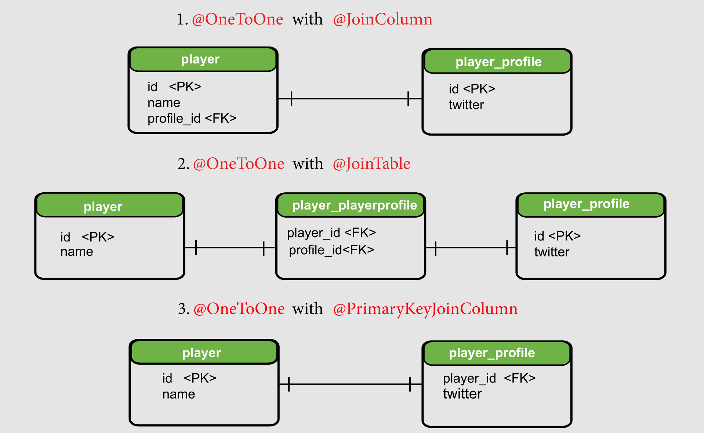

# Lesson 2: One-to-One Unidirectional Relationship

## Overview

We have a `player` table which stores the basic information about the player like id and name and a `player_profile` table which stores the additional details like the social media accounts of the players.

There is a __one-to-one relationship__ between `player` and `player_profile` tables and in this lesson, we will model it as a __one way/unidirectional relationship__.


## Demonstrated Concepts

### Dependencies

For this project, the following dependencies are needed:

- `spring-boot-starter-jpa`: uses Hibernate ORM framework.
- `spring-boot-starter-web`: supports web applications as well as REST services.
- `h2`: in-memory H2 database dependency.
- `spring-boot-devtools`: for auto restart functionality.
- `jackson-datatype-hibernate5`: provides support for Hibernate data types and specifically handles aspects of lazy-loading.

### Database Configuration

We add the data source URL in the `application.properties` file as well as enable the web console of the database.

```properties
spring.datasource.url = jdbc:h2:mem:testdb
spring.h2.console.enabled = true
```

We can also enable the `show-sql` property to displays the SQL queries executed by Hibernate:

```properties
spring.jpa.show-sql = true
```

In the `src/main/java/io/datajek/databaserelationships/onetoone` package, the `Player` class is marked as an entity using `@Entity` annotation. Since `id` is the __primary key__, we mark it with `@Id` annotation and let Hibernate generate values for this column using the `@GeneratedValue` annotation and a `GenerationType` of `IDENTITY`.

```java
@Entity
public class Player {
    @Id
    @GeneratedValue(strategy = GenerationType.IDENTITY)
    private int id;
    private String name;
}
```

Hibernate requires a _default constructor_. We also create an overloaded constructor to create the object using fields, getters and setters for the fields, and a `toString` method. 

The `PlayerProfile` class in the `onetoone` package holds miscellaneous information about a player and also mark it as an entity.

```java
@Entity
public class PlayerProfile {

    @Id
    @GeneratedValue(strategy = GenerationType.IDENTITY)
    private int id;

    private String twitter;

    // constructors
    // getters and setters

}
```

Visit the H2 console at `http://localhost:8080/h2-console` (and use `jdbc:h2:mem:testdb` as the connection URL).

> __Note from `ginny100`:__ Since I don't customize the h2 database configuration properties in the `application.properties` file, the information used in the h2-console login page is all default.
> 
> | Field          | Value                 |
> |----------------|-----------------------|
> | Saved Settings | Generic H2 (Embedded) |
> | Setting Name   | Generic H2 (Embedded) |
> | Driver Class   | org.h2.Driver         |
> | JDBC URL       | jdbc:h2:mem:testdb    |
> | User Name      | sa                    |
> | Password       |                       |

### One-to-One Relationship

In SQL, we represent relationships using __primary key__ and __foreign key__. 

Foreign keys are used to _link_ tables together. A foreign key is a field in one table that refers to the primary key in another table.

The `Player` class has a __one-to-one relationship__ with the `PlayerProfile` class. To show this relationship, we have the field `playerProfile` in the `Player` class and use the JPA annotation `@OneToOne` on this field.

`@OneToOne` is a JPA annotation which maps a source entity to a target entity.

```java
@Entity
public class Player {
    @Id
    @GeneratedValue(Strategy = GenerationType.IDENTITY)
    private int Id;

    private String name;

    @OneToOne
    private PlayerProfile playerProfile;

}
```

#### `cascade` property

The `cascade` property ensures that changes made to a `Player` entity are reflected in the `PlayerProfile` entity. The `PlayerProfile` entity does not have a meaning of its own, rather, it defines the `Player` entity. If we delete a `Player` entity, the associated details should also be deleted. 

Cascading allows an operation on the `Player` entity to be propagated to the `PlayerProfile` entity.

```java
@OneToOne(cascade = CascadeType.ALL)
private PlayerProfile playerProfile;
```

We have set the `CascadeType` to `ALL` meaning that all JPA and Hibernate specific operations on the `Player` entity will be propagated to the `PlayerProfile` entity.

> The absence of the cascade property, results in the `TransientPropertyValueException` exception when Hibernate tries to save a `Player` object containing a nested `PlayerProfile` object.

#### `@JoinColumn`

In relationships, one side is the _owning side_. We use the `@JoinColumn` annotation on the owning side. 

The `Player` class is the owning side of the relationship. The `@JoinColumn` annotation specifies the name of the foreign key column in the `player` table. We call the column `profile_id`. If the name is not specified, then JPA names the column based on some rules. In the `player_profile` table, the column that is being referenced is `id`. The name of the corresponding field in the `PlayerProfile` class is `id` which we specify as `referencedColumnName`.

```java
@Entity
public class Player {
    @Id
    @GeneratedValue(strategy = GenerationType.IDENTITY)
    private int id;

    private String name;
    
    @OneToOne(cascade = CascadeType.ALL) //, optional = false)
    @JoinColumn(name = "profile_id", referencedColumnName = "id")
    private PlayerProfile playerProfile;

}
```


After adding the `@OneToOne` annotation, if we run the application and check the H2 database, we can see that the `player` table has changed. It now contains a `profile_Id` column which references the id column in the `player_profile` table. The player table is called the owning table because here we store the foreign key.


It is a __unidirectional relationship__ because we have the reference of the `PlayerProfile` entity in the `Player` entity, but we _don’t_ have any reference of the `Player` entity in the `PlayerProfile` entity. We can retrieve the `PlayerProfile` object using the `Player` object but not the other way round.


### Persisting entities

Next, we create repositories for both classes, `Player` and `PlayerProfile`, that extend the `JpaRepository` interface. Since `JpaRepository` is a generic type, we need to specify the type of object as well as the datatype of the primary key.

Under `src/main/java/io/datajek/databaserelationships/repository`, the two interfaces named `PlayerRepository` and `PlayerProfileRepository` annotated them with `@Repository` are used to leverage the exception translation facility offered by Spring.

All classes in the service layer perform the CRUD operations on the entities. The package `service` holds all the service layer classes. 

All controller classes of the project are held under `src/main/java/io/datajek/databaserelationships/controller`. Inside this `controller` package, we have two classes `PlayerController` and `PlayerProfileController`. Use the `@RestController` annotation on these classes to create RESTful controllers. The `@RequestMapping` annotation on class level creates a base mapping for the methods in these classes. We use the `\players` mapping for the `PlayerController` class and `\profiles` mapping for the `PlayerProfileController` class.

The controllers contain methods to map `GET`, `POST`, and `DELETE` requests.

We can create a `Player` entity by sending a `POST` request to `http://localhost:8080/players` with the following request body:

```json
{
    "name": "Federer"
}
```

From the response, it can be seen that Hibernate assigns the player an `id` of 1.


Next we create a `PlayerProfile` entity by sending a `POST` request to `http://localhost:8080/profiles`.

```json
{
    "twitter" : "@rogerfederer"
}
```


Right now, both of these above entities are _not connected_. To assign the `PlayerProfile` to `Player`, we need to create a `PUT` mapping in the `PlayerController` class, which will enable us to send a request to `http://localhost:8080/players/{id}/profiles/{profile_id}` and update the `Player` entity. 

In the `PlayerController` class, we have a method named `assignDetail`, which serves this purpose. Using the `profile_id`, we retrieve the `PlayerProfile` entity and then pass it to the `assignProfile` method in the `PlayerService` class.

```java
@PutMapping("/{id}/profiles/{profile_id}")
public Player assignDetail(@PathVariable int id, @PathVariable int profile_id) {
    PlayerProfile profile = profileService.getPlayerProfile(profile_id); 
    return service.assignProfile(id, profile);
}
```

The `assignProfile` method in the `PlayerService` class is responsible for updating a `Player` record. It simply uses the setter method for the `playerProfile` field and then calls `save` to update the record in the database.

```java
public Player assignProfile(int id, PlayerProfile profile) {
    Player player = repo.findById(id).get();
    player.setPlayerProfile(profile);
    return repo.save(player);
}
```

With the above methods in place, we can send a `PUT` request to `http://localhost:8080/players/1/profiles/1`. This request will update the `Player` with `id` 1 and assign the `PlayerProfile` object with `id` 1 to it.


A `GET` request to `http://localhost:8080/players` also shows that the relationship has been established.


We can also create a `Player` object with a nested `PlayerProfile` object as follows:

```json
{
    "name": "Djokovic",
    "playerProfile": {
        "twitter" : "@DjokerNole"
    }
}
```

The result in Postman should look like this


This will not only insert a row in the `player` table but also insert a corresponding row in the `player_profile` table. Hibernate fires two `INSERT` queries because we have set the `CascadeType` to `ALL`. This ensures that changes to the `player` table are propagated to the `player_detail` table.


We can run the application and check the database tables in the H2 console (at `http://localhost:8080/h2-console` with `jdbc:h2:mem:testdb` as datasource URL) to verify that the player record has the correct foreign key for the `player_profile` record.

> __Note from `ginny100`:__ Since I don't customize the h2 database configuration properties in the `application.properties` file, the information used in the h2-console login page is all default.
>
> | Field          | Value                 |
> |----------------|-----------------------|
> | Saved Settings | Generic H2 (Embedded) |
> | Setting Name   | Generic H2 (Embedded) |
> | Driver Class   | org.h2.Driver         |
> | JDBC URL       | jdbc:h2:mem:testdb    |
> | User Name      | sa                    |
> | Password       |                       |

This is an example of a __unidirectional one-to-one relationship__. It is possible to retrieve a `PlayerProfile` object using a `Player` object but _no way_ to retrieve a `Player` object using a `PlayerProfile` object as can be seen from `GET` request to `http://localhost:8080/players`


... and `http://localhost:8080/profiles`.


The above results can be verified from the web console of H2 database by visiting `http://localhost:8080/h2-console` with `jdbc:h2:mem:testdb` as the connection URL and default information for the login page.

### Hibernate implementation of `@OneToOne`

Hibernate supports three variations of the `@OneToOne` mapping.

- Using __foreign key__ with the `@JoinColumn` annotation.
- Using a common join table which has __foreign keys__ of _both_ tables. The `@JoinTable` annotation defines a new table name which has the __foreign key__ from _both_ tables. This helps in modelling __optional one-to-one relationships__. If a player does not have a `PlayerProfile` entry, we have to use __null__ value in that column.
- Using a __shared primary key__ to save space. This approach uses a __common primary key__ (`player_id` in this case) in _both_ tables using the `@PrimaryKeyJoinColumn` (It eliminates the need of having an `Id` column for the `player_profile` table in our case.)

The figure below illustrates the three ways in which `@OneToOne` annotation can be used.

